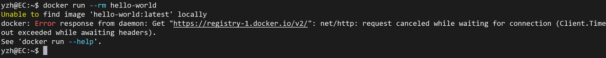
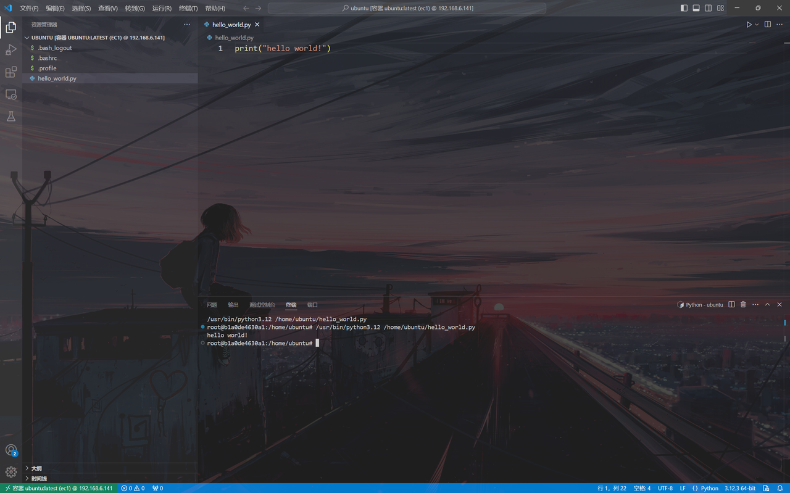
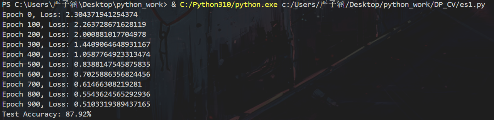
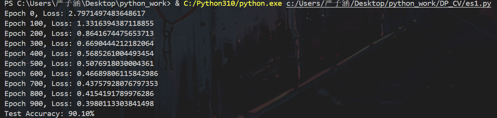
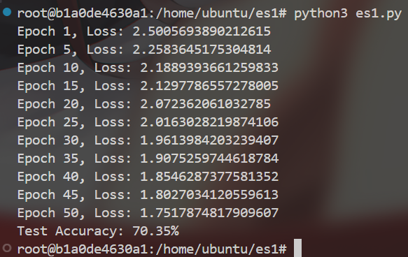

# 掌握Docker基础命令
> 实现此任务时，本人电脑为Windows 11操作系统，由于才疏学浅，本人曾经尝试在主机上下载过docker，但遇到了很多bug，所以目前是用VMware
创建一个Linux虚拟机，在虚拟机中进行相关操作。至于如何下载VMware、如何创建虚拟机云云，在此不做赘述  
Linux版本：Ubuntu 22.04.1  
内核版本：6.8.0-49-generic
## Docker的安装
Docker的安装我推荐参照这个链接
[Ubuntu安装Docker](https://vuepress.mirror.docker-pUractice.com/install/ubuntu/ "Ubuntu安装Docker")  
> 我个人认为这个教程略有繁琐，可结合网上（如CSDN）其他教程综合实践
- **常见问题：Docker下载镜像请求超时**  
具体情况大致如下：  
  
解决方案是配置加速地址，具体方法如下：  
```bash
sudo mkdir -p /etc/docker  # 一般这个目录在下载完Docker后都会自动创建，没有就手动创建
sudo tee /etc/docker/daemon.json <<-'EOF'  # 这是一个docker守护进程的JSON配置文件
{
    "registry-mirrors": [
        "https://do.nark.eu.org",
        "https://dc.j8.work",
        "https://docker.m.daocloud.io",
        "https://dockerproxy.com",
        "https://docker.mirrors.ustc.edu.cn",
        "https://docker.nju.edu.cn"
    ]
} 
EOF  # 这是个数组，其中保存数个URL地址（镜像源）
sudo systemctl daemon-reload   # 重新加载系统服务管理器的配置
sudo systemctl restart docker  # 重启docker服务
```  
配置加速地址可以参照这个链接[配置加速地址](https://blog.csdn.net/weixin_50160384/article/details/139861337 "配置加速地址")
## docker命令
- **run**： 创建并启动一个新容器
- **ps**：列出docker**容器**（默认只显示运行中的容器）
- **start**：启动一个或多个**已经创建的**容器
- **stop**：停止一个或多个运行中的容器
- **pull**：从docker注册表（例如 docker hub以及前面提到的镜像源）中下载镜像到本地
- **rm**：删除一个或多个**已经停止的容器**
- **rmi**：删除一个或多个docker**镜像**
- **exec**：在**运行中的**容器内执行一个命令
- **cp**：在docker容器和宿主机之间复制文件或目录
- **images**：列出本地的docker**镜像**
> - **inspect**：获取docker对象的详细信息，对象包括容器、镜像等
> - **attach**：附加到正在运行的docker容器的标准输入、输出和错误输出。允许用户与容器内部的进程进行交互，
就像直接在宿主机上运行该进程一样
> - **logs**：获取和查看容器的日志输出
## Ubuntu镜像
```bash
docker pull ubuntu # 这里直接拉取Ubuntu镜像，默认最新版本
docker run --name ec1 -dit ubuntu:latest # 此处容器名称为ec1（边缘计算1号）
```
通过以上两个命令，一个由Ubuntu镜像构建的容器（ec1）就启动了  
```bash
docker attach --detach-keys="ctrl-c" ec1 # 附加到ec1上，采用组合键“Ctrl + C”断开附加
apt update
apt install python3 # 下载Python3
```
> 上面的操作有三个目的：  
> 1. 算是对`attach`命令的一个练习
> 2. 如果能成功附加，证明容器创建成功并正常运行
> 3. 提前下载python3，为后续工作做铺垫

---

为方便在容器内编辑文件，采用vscode插件组“Remote Development”连接虚拟机中的容器。  
于`/home/ubuntu/`件夹下创建`hello_world.py`，并成功通过vscode执行，最终效果如下：  
  
> 参考网址：  
[SSH免密登录](https://blog.csdn.net/savet/article/details/131683156 "SSH免密登录")  
[vscode远程连接](https://blog.csdn.net/weixin_40641725/article/details/105512106 "vscode远程连接")
 MLP对MNIST分类
最简单的MLP为3层结构：输入层——隐藏层——输出层，代码在`c1.py`中  
部分模型参数解释：
- input_size=784：mnist数据集中的图片均为28\*28像素，28*28=784
- hidden_size=128：隐藏层设为128节点（可调）
- output_size=10：mnist数据集的标签个数为10
要运行此代码，需要在容器（ec1）中提前下载numpy与scikit-learn库。这里采用Ubuntu自带的包管理器apt下载
> 本人尝试过使用pip下载但会报错，大致意思为包管理器冲突，故方便起见采用apt下载
```bash
apt install python3-numpy
apt install python3-sklearn
```

---

在采用随机初始化的条件下，训练结果如下：

在采用Xavier初始化的条件下，训练结果如下：

可以看出Xavier初始化能够有效提高模型训练的收敛速度（随机初始化条件下误差到达1左右需要400轮，Xavier不到200轮；
到达0.5左右随机初始化需要900轮，Xavier不到500轮），并一定程度上提高模型训练正确率
> 由于时间关系，以上操作是在主机而非容器中进行。主要目的是为了展示`ec1.py`代码的正确性

在容器中运行此代码，容器的宿主机（Linux虚拟机）配置为4GB内存，2个单核CPU。目前粗略统计每进行一轮迭代需要花费**8.3秒**，
迭代1000轮运行时间很长。下图是迭代50轮的结果
