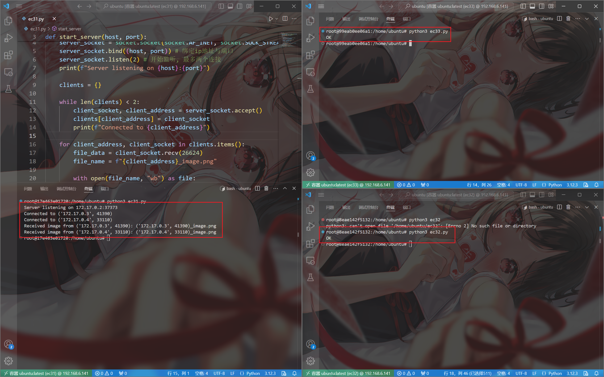

# 三节点TCP通信
**环境**：在Linux下，创建三个Ubuntu镜像容器，一个代表server服务器，两个代表client客户端

---

## 实现
> 三个容器都要提前下载python3
### server服务器
代码在`server.py`中  
在容器中下载`iproute2`依赖包，通过`ip addr`命令查看作为server服务器的容器的ip地址，并选择一个端口进行绑定
### client客户端
代码在`client.py`中，两个容器使用完全相同的代码即可
## 运行结果

上图中左侧是server服务器，右侧是两个client客户端。
可以看到服务器成功从两个客户端收到了图片并输出了客户端名称（ip地址）与对应的图片名称；两个客户端也是输出了“OK”
> 这里客户端并没有向服务器发送图片的本地名称，服务器端的图片名称为客户端ip地址+“_image”构成。
重点在于分清楚哪个图片是哪个客户端发送的，只要这个搞清楚了，本练习的主要目的就达到了