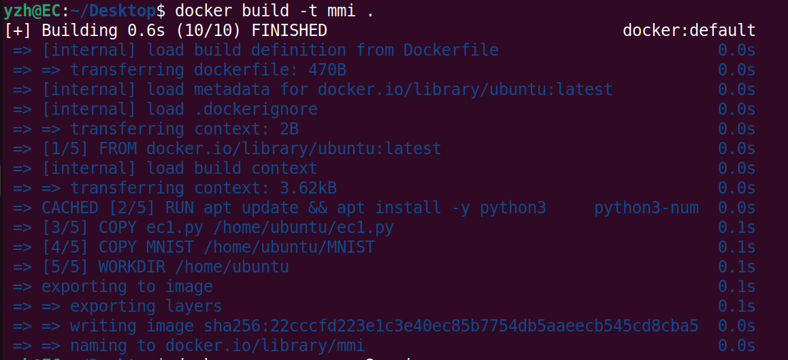
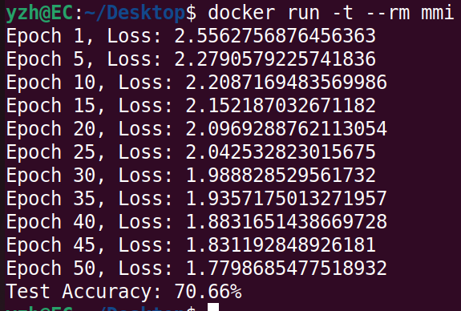

# Dockerfile编写和镜像编译
## dockerfile的编写
Dockerfile是一个用来构建镜像的文本文件，包含了构建Docker镜像的指令。文本内容包含了**一条条**构建镜像所需的指令和说明。
通过定义一系列命令和参数，Dockerfile指导Docker构建一个自定义的镜像  
本任务使用的dockerfile文件内容如下：
```dockerfile
# 使用现有的Ubuntu镜像作为基础镜像
FROM ubuntu:latest

# 安装依赖
RUN apt update && apt install -y python3 \
    python3-numpy \
    python3-sklearn \
    && rm -rf /var/lib/apt/lists/*  

# 将MLP代码和MNIST数据集复制到容器内
COPY ec1.py /home/ubuntu/ec1.py
COPY MNIST /home/ubuntu/MNIST

# 设置工作目录
WORKDIR /home/ubuntu

# 设置容器启动时执行的命令
CMD [ "python3", "ec1.py" ]
```
> `rm -rf /var/lib/apt/lists/*`这条命令用于删除apt包管理的缓存，减少构建出来的镜像的大小
## 镜像编译
执行`docker build -t mmi .`命令即可，“mmi”表示打包出来的镜像的名称，“.”表示使用当前路径下的dockerfile及其他资源进行编译
> mmi，MLP MNIST image
### 编译结果

这是多次修改dockerfile、多次编译后的结果。由于docker镜像编译存在缓存机制，所以本次编译很快。第一次编译用时很长（五百多秒），
主要耗时集中在
`RUN apt update && apt install -y python3 python3-numpy python3-sklearn && rm -rf /var/lib/apt/lists/*`这一条命令
## 创建并运行容器
执行命令`docker run -t --rm mmi`
> 这里`-t`表示给容器内的进程分配一个伪终端，
使容器内的进程可以输出文本到标准输出（stdout）和标准错误（stderr）。由于我们的目的只是“创建容器——运行代码——输出结果”，
容器没有持续运行的必要，所以采用`--rm`在容器退出后自动删除容器。由于这里的MLP程序不需要交互，
所有没有采用常见的`-it`开放标准输入（stdin）
### 运行结果
