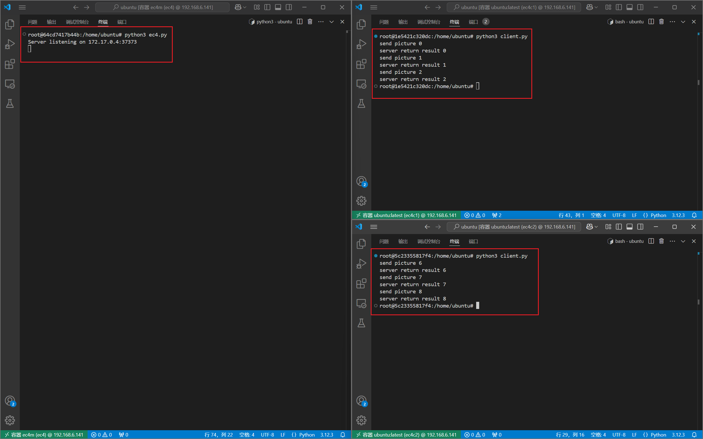
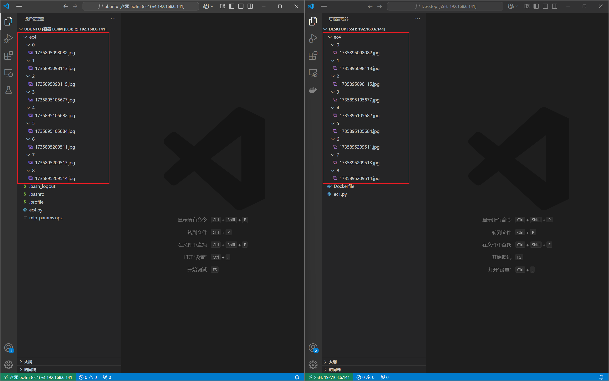

# 任务报告
本次任务可以看作是第一周与第三周的结合体。整体实现思路为将二者代码相结合，在创建容器时采用docker的映射机制即可  
创建容器前，先在宿主机上创建`ec4`目录，以备目录映射用
## 实现
> 这里的两个client客户端容器与第三周工作中的一样创建即可，server服务器容器因为要做端口与目录映射，所以创建过程稍有不同。
下面先介绍代码，之后解释创建命令
### server服务器
代码在`server.py`中  
其中模型初始化所使用的参数来自本人windows主机上，按照第一周工作的方式进行1000轮迭代训练得到，分类准确率约为90%  
在容器中下载`iproute2`依赖包，通过`ip addr`命令查看作为server服务器的容器的ip地址，并选择一个端口进行绑定
### client客户端
代码在`client.py`中，两个容器使用完全相同的代码即可
### 创建server服务器容器
因为要做目录映射，所以在宿主机上新建一个`ec4`目录备用  
在这里我选择编写一份新的dockerfile来创建服务器容器的专属镜像
```dockerfile
# 使用现有的Ubuntu镜像作为基础镜像
FROM ubuntu:latest

# 安装依赖
RUN apt update && apt install -y python3 \
    python3-numpy \
    python3-sklearn \
    && rm -rf /var/lib/apt/lists/*    

# 创建要用来映射的目录
RUN mkdir -p /home/ubuntu/ec4

# 设置工作目录
 WORKDIR /home/ubuntu
```
根据此镜像创建出来的容器就会自动生成一个`/home/ubuntu/ec4`用于目录映射  
创建服务器容器的命令为`docker run -p 37373:37373 -v /home/yzh/Desktop/ec4:/home/ubuntu/ec4 -dit --name ec4 ubuntu:latest`
这里用于映射的端口号可以自行选择，目录路径根据实际情况更改
## 最终效果

服务器显示开始监听，两个客户端分别向服务器发送了三张图片并打印出服务器返回的结果


同时打开宿主机与server容器上的`ec4`目录可以看到，二者的内容完全一样